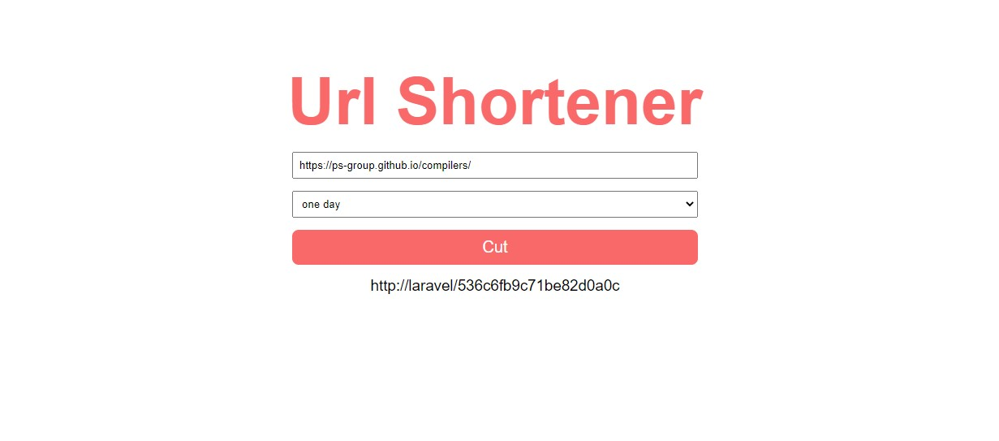

<p align="center"></p>

<h3 align="center">Web Application which shortens links</h3>

## Installation

1. Clone the repo
```sh
> git clone https://github.com/choppyratz/UrlShortener-Laravel.git
```
2. Go to the project folder
```sh
>  cd ./ProjectFolder
```
3. Change database connection information in .env
4. Create database with the name that is indicated in .env
5. Install migrations
```sh
>  php artisan migrate
```
## Manual
To delete expired Urls, you can use special command. Also this command set in the task scheduler:
```sh
>  php artisan delete:expiredUrls
```
### Built With
* [PHP 7.4](https://www.php.net/)
* [Laravel](https://www.laravel.com/)
* [MySQL](https://www.mysql.com/)
## Contact
Telegram - @Choppyratz
Email - germanletchik@yandex.ru
